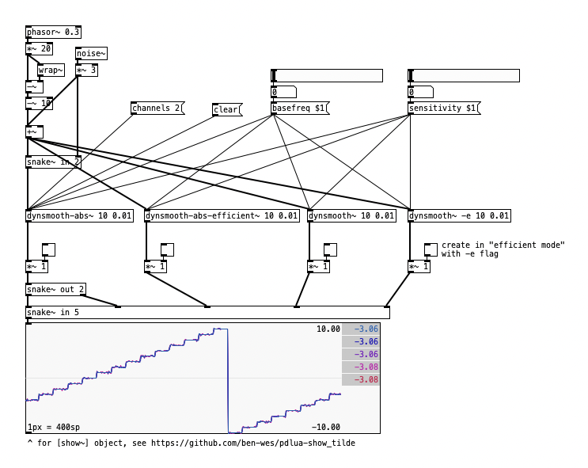

# [dynsmooth~]

dynamic smoothing external (and vanilla abstractions) for Pd (Pure Data)
based on https://cytomic.com/files/dsp/DynamicSmoothing.pdf

For more context on discussion see https://forum.pdpatchrepo.info/topic/14933/dynamic-smoothing-andrew-simper-style

## Build and Installation Instructions
To compile and install, follow these steps. Note that [Makefile.pdlibbuilder](https://github.com/pure-data/pd-lib-builder/) is included as submodule, requiring the `--recursive` parameter.
~~~
git clone --recursive git@github.com:ben-wes/pd-dynsmooth_tilde.git
cd pd-dynsmooth_tilde
make install
~~~

... you'll then find the library in the `build` folder
